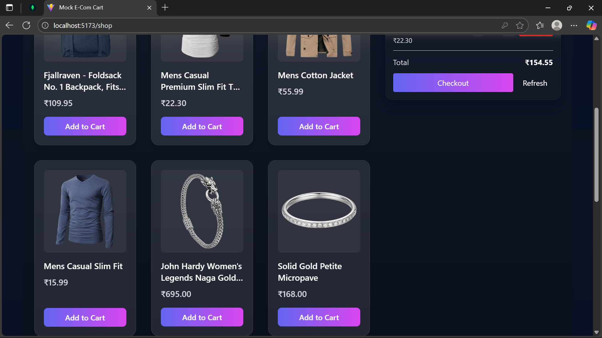
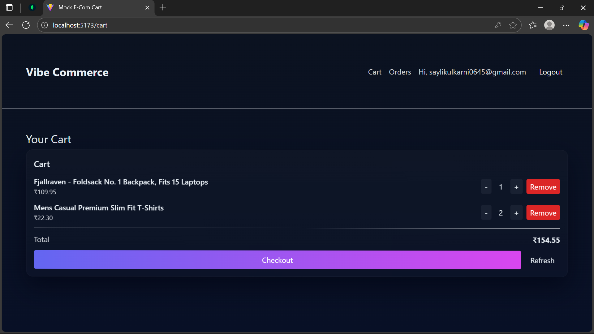
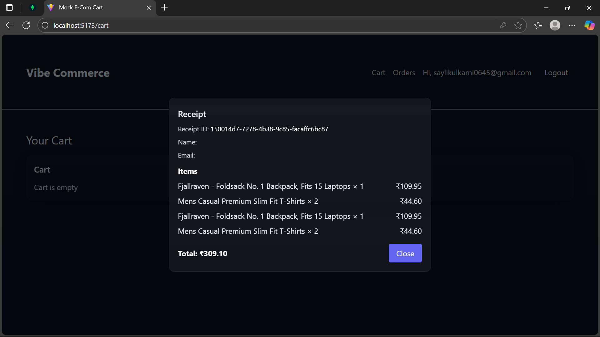
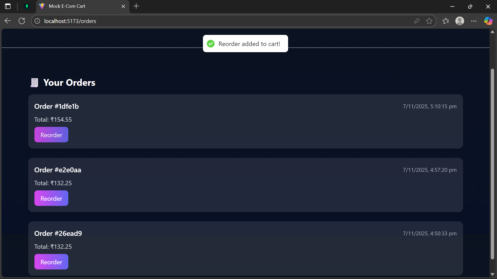

# 🛍️ Mock E-Com Cart — Vibe Commerce Screening

A full-stack shopping cart demo built using React, Node.js, Express, and SQLite.

---

## 🧩 Tech Stack

* **Backend:** Node.js, Express, SQLite
* **Frontend:** React (Vite), Tailwind CSS, Framer Motion
* **Auth:** bcrypt + JWT (optional; included)
* **Database:** SQLite (`backend/db/database.sqlite`)

---

## 📂 Folder Structure

```
ecom-cart/
├─ backend/    # Server, routes, DB initialization
├─ frontend/   # React application
└─ README.md
```

---

## 🖥 Backend Setup

```bash
cd backend
npm install
cp .env.example .env    # update JWT_SECRET 
npm run dev
# Server runs on http://localhost:4000
```

Test endpoint: [http://localhost:4000/api/products](http://localhost:4000/api/products)

---

## 💻 Frontend Setup

```bash
cd frontend
npm install
cp .env.example .env
npm run dev
# Runs on http://localhost:5173
```

---

## ✨ Features

* Fetch and display real products from FakeStore API
* Add / update / remove items from cart
* Dynamic cart total calculation
* Mock checkout with receipt stored in DB
* Register & login with JWT authentication
* Modern and responsive UI with Tailwind + Framer Motion
* Persistent cart using SQLite

---

## ⚙️ Environment Setup

### Backend `.env.example`

```env
PORT=4000
DB_PATH=./db/database.sqlite
JWT_SECRET=JWT_SECRET_KEY
```

### Frontend `.env.example`

```env
VITE_API_BASE=http://localhost:4000/api
```

---

## 📜 Scripts

Run both frontend and backend simultaneously:

```bash
npm i -D concurrently
```

Create a root `package.json` file:

```json
{
  "scripts": {
    "dev": "concurrently \"npm run dev --prefix backend\" \"npm run dev --prefix frontend\""
  }
}
```

Then run everything with:

```bash
npm run dev
```

---

## 🧾 API Endpoints

| Method | Endpoint             | Description                    |
| ------ | -------------------- | ------------------------------ |
| GET    | `/api/products`      | Fetch all products             |
| GET    | `/api/cart`          | Get current cart & total       |
| POST   | `/api/cart`          | Add item to cart               |
| PUT    | `/api/cart/:id`      | Update item quantity           |
| DELETE | `/api/cart/:id`      | Remove item from cart          |
| POST   | `/api/checkout`      | Mock checkout (stores receipt) |
| POST   | `/api/auth/register` | Register new user              |
| POST   | `/api/auth/login`    | Login existing user            |

---

## 📦 Deliverables

* GitHub repository containing `/backend` and `/frontend`
* `/assets/screenshots/` folder containing:

  * 1-Login.png
  * 2-Products.png
  * 3-Cart.png
  * 4-Receipt.png
  * 5-Orders.png
* 1–2 minute demo video (Loom / YouTube unlisted)
* README with setup & usage instructions

---

## 📸 Screenshots

Here’s a quick look at the core screens of **Vibe Commerce** — from login to checkout!

| 🧑‍💻 Login | 🛍️ Products | 🛒 Cart |
|------------|--------------|----------|
|  |  |  |

| 💳 Receipt | 📦 Orders |
|-------------|------------|
|  |  |

---

## 🎥 Demo Video

🎬 [Watch the demo on Loom](https://www.loom.com/share/5f1f40e423f145c9b2afe99ecc077f00)

---

## 👩‍💻 Developer

**Sayli Kulkarni**
Full Stack Developer | MERN | JavaScript | React | Node.js
📧 [saylikulkarni0645@gmail.com](mailto:saylikulkarni0645@gmail.com)
